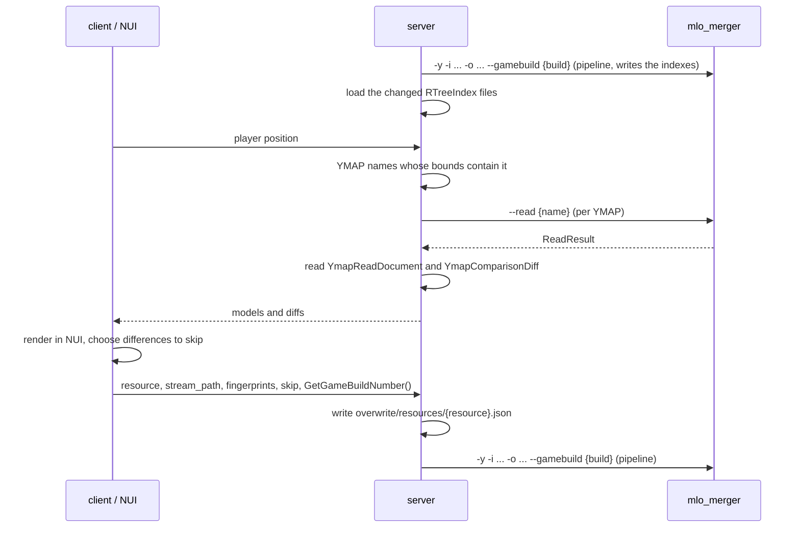

# Using MLO Merger From A FiveM Resource

This guide shows how a FiveM resource calls the `mlo_merger` executable to show
nearby YMAP changes in NUI and to write overwrites that leave chosen changes out
of the merge. See the [command reference](reference.md) for every option and
[ARCHITECTURE](ARCHITECTURE.md) for the workflow.

## Types

The JSON files and outputs below have TypeScript types in `asset/gen_mlo_merger.ts`.
It is included in release archives; in a checkout, generate it with `cargo export-types`.

Release archives also contain `release.json`, naming the build they hold:

```json
{
  "name": "mlo_merger",
  "version": "2.0.0",
  "tag": "v2.0.0",
  "commit": "<commit SHA>",
  "repository": "https://github.com/nnnnusui/mlo_merger",
  "release_url": "https://github.com/nnnnusui/mlo_merger/releases/tag/v2.0.0",
  "targets": ["aarch64-apple-darwin", "x86_64-apple-darwin", "x86_64-pc-windows-msvc", "x86_64-unknown-linux-gnu"]
}
```

`targets` lists the platforms whose executables the archive holds: one in a platform
archive, every one in `mlo_merger-all.zip`. `mlo_merger-all.zip` also holds the browser build
in `web/`, described under `web` in its `release.json`; see [Browser build](web.md).

| Data | Type |
|---|---|
| Stream-file bounds index | `RTreeIndex`, `RTreeItem`, `RTreeInput` |
| `--read` stdout | `ReadResult`, `ReadFileResult`, `ReadOrigin` |
| `--read` JSON documents | `YmapReadDocument`, `ReadFingerprint`, `Ymap`, `YmapEntity`, `Position`, `Rotation` |
| Source-cache diff documents | `YmapComparisonDiff`, `YmapComparisonFile`, `YmapDiffFields`, `YmapEntityDiff`, `YmapEntityFieldDiff` |
| Changes carried to newer DLC generations | `YmapPropagatedDiff`, `YmapPropagationOrigin` |
| Vanilla YMAP generations | `GenerationIndex`, `GenerationUnit` |
| Overwrite documents | `ResourceOverwrite`, `StreamFileOverwrite`, `OverwriteFingerprint`, `YmapDiffSkip`, `VanillaOverwrite` |
| Pipeline stdout | `PipelineReport`, `PipelineChanges`, `StoreChanges`, `IgnoredOverwrite`, `IgnoredOverwriteReason` |
| Merge diagnostics | `DuplicateReport` |

```typescript
import type {
  OverwriteFingerprint, PipelineReport, ReadResult, ResourceOverwrite, RTreeIndex, Ymap,
  YmapComparisonDiff, YmapDiffSkip, YmapEntity, YmapEntityDiff, YmapReadDocument,
} from "./gen_mlo_merger";
```

The examples below copy it to `shared/gen_mlo_merger.ts`.

## Running The Executable

Start the executable from server-side code with `spawn` (spawnProcess).

- Always pass an operation flag. Without arguments the executable opens the vanilla
  generator GUI; run the pipeline as `mlo_merger --pipeline`.
- Set the working directory to the directory containing `asset/`. Every path
  below, and every command default, is relative to it.
- Paths recorded in the JSON files are relative to the store holding each file (see
  [Recorded Paths](#recorded-paths)), so they stay valid when `asset/` moves. Command results
  on stdout name files as the command was given them.
- stdout carries only the command's result; `--read` and the pipeline each print one
  line of JSON.
- stderr carries progress logs and errors. The same log is written to
  `asset/log/mlo_merger_{timestamp}.log`, which is only created when the run logs
  something.
- A failed command exits with code `1`; its last stderr line is the error.
- Commands never prompt. Pipeline commands also accept `-y`.

```typescript
// server/merger.ts
import { spawn } from "child_process";

const MERGER = "C:/tools/mlo_merger/mlo_merger.exe";
export const MERGER_CWD = "C:/tools/mlo_merger"; // contains asset/

export interface MergerOutput {
  stdout: string;
  stderr: string;
}

export function runMerger(args: string[]): Promise<MergerOutput> {
  return new Promise((resolve, reject) => {
    const child = spawn(MERGER, args, { cwd: MERGER_CWD, windowsHide: true });
    let stdout = "";
    let stderr = "";
    child.stdout.on("data", (chunk: Buffer) => (stdout += chunk));
    child.stderr.on("data", (chunk: Buffer) => (stderr += chunk));
    child.on("error", reject);
    child.on("close", (code) =>
      code === 0 ? resolve({ stdout, stderr }) : reject(new Error(stderr.trim().split("\n").pop()))
    );
  });
}
```

### Game Build

Pass the game build the server's clients run, the value `GetGameBuildNumber()` returns on
a client, as `--gamebuild` to every command that runs the vanilla-cache step: the pipeline,
`--generate-vanilla-cache`, `--generate-source-cache` and `--merge`. The vanilla cache and
merge then use vanilla files as of that build, so they match `sv_enforceGameBuild`. On the
server `GetGameBuildNumber()` returns `0`, so a client has to send the value.

- Omit `--gamebuild` when the value is `0` (unknown); the vanilla cache then uses the
  latest installed stage.
- Pass the same value to every run. A run without it, or with another build, rebuilds the
  vanilla cache for that build.
- A build that is not listed under `[gamebuild]` in `asset/config.toml` uses the closest
  listed build below it and logs a warning; add it there when FiveM supports a new build.

```typescript
// server/merger.ts
/** `--gamebuild` for a client's `GetGameBuildNumber()`; none for 0 (unknown). */
export const gameBuildArgs = (build: number): string[] =>
  build > 0 ? ["--gamebuild", String(build)] : [];
```

Paths below are defaults. If you change them with options such as `--source-cache`,
`--overwrite` or `-o`, change the paths you read accordingly.

## Recorded Paths

Every path recorded in a JSON file is relative to a store, never absolute, so the files stay
valid when `asset/` is moved or the stores are named by other paths; only their contents
decide whether a stage reuses its output.

| Path relative to | Recorded for |
|---|---|
| The source cache (`asset/source-cache`) | Source files moved into the cache: `resources/{resource}/{stream path}` |
| The source root (`asset/source`) | Resources (their IDs), source files left in them, and each source's original path |
| The vanilla cache (`asset/vanilla-cache`) | Latest vanilla files: `latest/{ymap,ybn}/{file name}` |
| The vanilla archive (`asset/vanilla`) | Vanilla versions read by `--read`, and `hash_names.json` |
| The merge output (`asset/merged`) | Merged files: `{ymap,ybn}/{file name}` |

A bounds index's `path` and a merge input's `path` name the file relative to its own store:
a source file moved into the cache relative to the source cache, otherwise relative to the
source root. `originalPath` and a merge input's `original_path` are always relative to the
source root.

## Commands And Files

| Step | Arguments | Result | Files to read afterwards |
|---|---|---|---|
| Index file bounds | none; written by vanilla-cache, source-cache and merge runs | | `asset/{vanilla-cache,source-cache,merged}/stream_file_rtree.json` (`RTreeIndex`) |
| Convert YMAPs to JSON | `--read FILE` | `ReadResult` | each `files[].output` (`YmapReadDocument`) |
| Inspect differences | none; written by source-cache generation | | `asset/source-cache/diff/{resource}/{stream_path}.diff.json` (`YmapComparisonDiff`) |
| Inspect changes carried to newer DLC generations | none; written by source-cache generation | | `asset/source-cache/propagated/{resource}/{file_name}.diff.json` (`YmapPropagatedDiff`); each carried item's `reason` names the item it came from |
| Inspect vanilla version differences | none; vanilla-cache generation would write them, but it is currently disabled | | `asset/vanilla-cache/ymap_versions.json` (`VanillaYmapVersionIndex`), then `asset/vanilla-cache/diff/{version}/ymap/{name}.diff.json` (`VanillaYmapDiff`) for each version after a YMAP's first |
| Apply overwrites | `--pipeline`, or `--merge` then `--deploy` | `PipelineReport` (pipeline only) | `asset/merged/duplicates.json` (`DuplicateReport`) |

### Stream-File Bounds Indexes

Each store keeps the bounds of its stream files in its own `stream_file_rtree.json`, written
when the store is built (by its own command or by the pipeline):

| Index | Files | Listed from | Rebuilt after |
|---|---|---|---|
| `asset/vanilla-cache/stream_file_rtree.json` | latest vanilla files | `asset/vanilla-cache/cache_info.json` | a vanilla-cache update |
| `asset/source-cache/stream_file_rtree.json` | inventoried source stream files, in source or moved into the cache | `asset/source-cache/cache_info.json` | a source-cache update |
| `asset/merged/stream_file_rtree.json` | merged files | `asset/merged/cache_info.json` | a merge that changed output |

Each `RTreeIndex` has `ymap` and `ybn` arrays of `RTreeItem`s with RBush-compatible
`minX`/`minY`/`maxX`/`maxY`, plus `minZ`/`maxZ`, the file `name` and `path`, the `resource`
ID (and `originalPath`, relative to the source root, when moved into the cache) for source
files, and the `version` for
vanilla files. Its `input` records the fingerprint of the metadata it was listed from.

A vanilla item's `version` is the version folder holding the file, the same value `--read`
reports as `origin.Vanilla.version`, so once read its document is
`asset/read-cache/vanilla/{version}/ymap/{name}.json`. `--read` reads vanilla as of the stage
the vanilla cache was built for, so the two agree whichever `--gamebuild` the pipeline ran
with.

An index is rewritten only when that metadata changed, or when the index is missing or of an
earlier layout, so a run that reuses its store also creates the index of an existing store.
An index that changed has a new `timestamp`; reload an index when its file changed. Source
files outside the inventory, such as YMAPs outside `stream/`, are not indexed, and source
changes appear only after the source cache is updated. Files whose bounds cannot be read are
left out with a warning.

Load the result into RBush, or filter it directly, to find the files at a position.

### `--read`

```bash
mlo_merger --read hei_ch1_11.ymap
mlo_merger --read hei_ch1_11.ymap hei_ch1_12.ymap
```

Given only file names, `--read` reads each file from every resource holding it and from
vanilla. The last stdout line is a `ReadResult`:

```json
{"files":[
  {"origin":{"Resource":{"resource":"sample_resource_a","stream_path":"hei_ch1_11.ymap"}},
   "input":"asset/source-cache/resources/sample_resource_a/hei_ch1_11.ymap",
   "output":"asset/read-cache/resources/sample_resource_a/hei_ch1_11.ymap.json","updated":true},
  {"origin":{"Vanilla":{"version":"0012-mpheist","file_name":"hei_ch1_11.ymap"}},
   "input":"asset/vanilla/0012-mpheist/ymap/hei_ch1_11.ymap",
   "output":"asset/read-cache/vanilla/0012-mpheist/ymap/hei_ch1_11.ymap.json","updated":false}
]}
```

- `output` is the `YmapReadDocument` to read; its `model` is the `Ymap`.
- `updated: false` means the existing JSON still describes the file and was not rewritten.
  It is still valid to read.
- For `origin.Resource`, `resource` (the resource directory name) and `stream_path`
  (the path below `stream/`) also key the diff document and the overwrite.
- For `origin.Vanilla`, `version` is the version folder holding the file: the last version,
  up to the stage read, that changed it, not necessarily that stage itself. Its document
  sits under that folder in `asset/read-cache/vanilla`.
- Vanilla is read as of the stage the vanilla cache was built for, the game build the last
  pipeline ran with, so it is the vanilla the merge used; pass `--gamebuild` to read another
  build's.
- If a resource holds several files with that name, the command fails and writes nothing.
  Read them individually with `--resource NAME stream/relative/path.ymap`.
- Several names are read in one run, in the order given. If any name matches no file or is
  ambiguous, the whole command fails and writes nothing, so read names one at a time when
  some may be missing.
- `--read --all` reads every YMAP of every resource and of vanilla, for
  tools that want all documents up front.

### Diff Documents

Source-cache generation writes one diff document for every source YMAP that replaces a
vanilla YMAP:

```text
asset/source-cache/diff/{resource}/{stream_path}.diff.json
```

- `diffs` holds the resource's differences from vanilla. Overwrite `skip` selectors pick
  entries from it.
- Copy `source.sha256`/`size` and `vanilla.sha256`/`size` into the overwrite unchanged.
  `source.path` and `vanilla.path` name the files relative to their stores, such as
  `resources/{resource}/{stream_path}` and `latest/ymap/{file_name}`.
- Array differences are `Added`, `Removed`, `Modified` (and `Replaced` for non-entity arrays).
  `Removed.index` and `Modified.before_index` index the vanilla model, and
  `Modified.after_index` indexes the source model. Added entities carry their whole
  entity, including its `guid`.
- YMAPs without a diff document, such as custom YMAPs that replace no vanilla file, cannot
  be overwritten.

### Overwrite Documents

```text
asset/overwrite/resources/{resource}.json
```

```json
{
  "schema_version": 1,
  "files": {
    "hei_ch1_11.ymap": {
      "source":  { "sha256": "<diff document source.sha256>",  "size": 5638 },
      "vanilla": { "sha256": "<diff document vanilla.sha256>", "size": 5675 },
      "skip": {
        "entities": [
          { "Modified": { "before_index": 0, "changes": { "position": true } } },
          { "Added": { "entity": { "guid": 1513947137 } } }
        ],
        "box_occluders": [{ "Removed": { "index": 0 } }]
      }
    }
  }
}
```

- `files` is keyed by `stream_path`. There is one document per resource, so read it and
  replace only the entry you are changing.
- In an object, `true` leaves out a field's whole difference; a nested selector leaves out
  only the parts it names.
- In an array, a selector leaves out the entries whose written fields all match. With
  `changes`, only the named changes are left out rather than the whole entry.
- An overwrite whose `source` or `vanilla` no longer matches the current files is not
  applied. The pipeline lists it in `ignored_overwrites` (see
  [Pipeline Output](#pipeline-output)) on every run until it is rewritten from the new diff
  document.

See [docs/sample/overwrite](sample/overwrite/README.md) for complete examples.

### Vanilla Overwrite Documents

```text
asset/overwrite/vanilla/latest/ymap/{file_name}.diff.json
```

```json
{
  "schema_version": 1,
  "vanilla": { "sha256": "<latest vanilla file sha256>", "size": 5675 },
  "diffs": {
    "entities": [{ "Removed": { "index": 3 } }]
  }
}
```

- `diffs` is written in the same shape as a diff document's `diffs`, against the latest vanilla
  model (`--read` returns it with its fingerprint): `Removed.index` and `Modified.before_index`
  index the vanilla model.
- It is merged as the last source, after every resource's diff with its resource overwrite
  applied. The merge policy still decides: a removal wins, and otherwise a resource's earlier
  change to the same item wins over the overwrite.
- Name, flags, extents, block, the distant LOD light counts and physics dictionary removals
  are left out of every resource's diff but apply from the vanilla overwrite. To keep a
  resource's extents, for example, copy its `streaming_extents_*`/`entities_extents_*`
  differences from the resource's diff document into the vanilla overwrite. The value is
  tied only to the vanilla file, so it is not updated when the resource changes.
- A vanilla YMAP with an overwrite is merged even when no resource replaces it.
- An overwrite whose `vanilla` no longer matches the latest vanilla file is not applied and is
  listed in the pipeline's `ignored_overwrites`. Rewrite it after a vanilla update.

### Applying Overwrites

```bash
mlo_merger --pipeline -y -i <resources directory> -o <deployed resource> --gamebuild <GetGameBuildNumber()>
```

The pipeline updates the source cache, merges and deploys only what changed. Overwrites are
part of merge freshness, so `-f` is not needed. Use `--merge` alone to update only
`asset/merged`. Overwrites that are not applied are listed in the pipeline's
`ignored_overwrites`; both commands also log each one on stderr as a warning starting with
`Overwrite of`.

#### When Source Or Vanilla Files Change

An overwrite is written against the files its fingerprints name. When a resource is updated
or the game build moves the latest vanilla file, the next run (the pipeline updates the source
cache first) merges the file again without the overwrite: the overwrite is left out whole,
not partially applied, and the overwrite document is not changed. The merge does not fail.

- A merge that reuses its previous output still checks every overwrite, so
  `ignored_overwrites` lists an outdated overwrite on every run, not only on the run where the
  files changed.
- Write a new overwrite from the current diff document (or, for a vanilla overwrite, the
  current `--read` fingerprint), or remove the entry, to clear it.
- Selectors of an applied overwrite that match no difference are only logged on stderr as
  `Overwrite of ... skips ..., which is not among the differences`; the rest of that
  overwrite still applies.

### Pipeline Output

The pipeline prints one line of `PipelineReport`: the files its cached stages added, modified
or removed (`PipelineChanges`), and the overwrites the merge did not apply:

```json
{
  "vanilla_cache": { "added": [], "modified": [], "removed": [] },
  "source_cache": {
    "added": [],
    "modified": ["asset/source-cache/resources/sample_resource_a/hei_ch1_11.ymap"],
    "removed": []
  },
  "merged": { "added": [], "modified": ["asset/merged/ymap/hei_ch1_11.ymap"], "removed": [] },
  "ignored_overwrites": [
    { "resource": "sample_resource_a", "file": "hei_ch1_11.ymap", "reason": "source_changed" },
    { "file": "hei_ch1_12.ymap", "reason": "vanilla_changed" }
  ]
}
```

- Each path is placed below the directory the pipeline used for that store (`--vanilla-cache`,
  `--source-cache`, `--merged`), so with the defaults it is relative to the working directory.
- `vanilla_cache` lists the latest vanilla YMAP/YBN links of `asset/vanilla-cache/latest/`,
  `source_cache` the stream files moved into the cache, and `merged` the merged stream files.
  Metadata, indexes and diff documents are not listed.
- Only content changes count: a forced rebuild that writes the same bytes lists nothing, and a
  run that changes nothing prints empty lists.
- `ignored_overwrites` is the current state, not a change: it lists every overwrite that does
  not apply to the current files, on every run. An entry with `resource` is that resource
  document's `files[file]`; one without is the vanilla overwrite
  `vanilla/latest/ymap/{file}.diff.json`. Both names are lowercase; documents are matched
  case-insensitively. `reason` is one of:

  | `reason` | Meaning |
  |---|---|
  | `source_changed` | The source YMAP differs from `source` |
  | `vanilla_changed` | The latest vanilla YMAP differs from `vanilla` (the source, if any, is unchanged) |
  | `missing_source` | The resource merges no YMAP at `file`, for example after it was removed or excluded |
  | `missing_vanilla` | No latest vanilla YMAP is named `file` |
- Deployment is not included; its counts are logged on stderr.

## Example: From Player Position To Overwrite

This example finds the YMAPs around the player, converts them to JSON, renders their
differences in NUI, and writes the differences the user rejects as an overwrite.


```mermaid
sequenceDiagram
    participant C as client / NUI
    participant S as server
    participant M as mlo_merger
    S->>M: -y -i ... -o ... --gamebuild {build} (pipeline, writes the indexes)
    S->>S: load the changed RTreeIndex files
    C->>S: player position
    S->>S: YMAP names whose bounds contain it
    S->>M: --read {name} (per YMAP)
    M-->>S: ReadResult
    S->>S: read YmapReadDocument and YmapComparisonDiff
    S-->>C: models and diffs
    C->>C: render in NUI, choose differences to skip
    C->>S: resource, stream_path, fingerprints, skip, GetGameBuildNumber()
    S->>S: write overwrite/resources/{resource}.json
    S->>M: -y -i ... -o ... --gamebuild {build} (pipeline)
```

### Shared Message Types

```typescript
// shared/types.ts
import type { OverwriteFingerprint, Ymap, YmapComparisonDiff, YmapDiffSkip } from "./gen_mlo_merger";

/** One source YMAP sent to NUI. */
export interface InspectedFile {
  name: string;
  resource: string;
  streamPath: string;
  /** The source model; `after_index` points into its arrays. */
  model: Ymap;
  /** The latest vanilla model; `index` and `before_index` point into its arrays. */
  vanilla: Ymap | null;
  diff: YmapComparisonDiff | null;
}

/** Differences of one source YMAP to leave out of the merge. */
export interface SkipRequest {
  resource: string;
  streamPath: string;
  source: OverwriteFingerprint;
  vanilla: OverwriteFingerprint;
  skip: YmapDiffSkip;
}
```

### 1. Client: Send The Position

```typescript
// client/main.ts
import type { InspectedFile, SkipRequest } from "../shared/types";

RegisterCommand("mloinspect", () => {
  const [x, y, z] = GetEntityCoords(PlayerPedId(), false);
  emitNet("mlo:inspect", x, y, z);
}, false);

onNet("mlo:files", (files: InspectedFile[]) => {
  SetNuiFocus(true, true);
  SendNUIMessage({ type: "files", files });
});

RegisterNuiCallbackType("skip");
on("__cfx_nui:skip", (request: SkipRequest, cb: (result: unknown) => void) => {
  emitNet("mlo:skip", request, GetGameBuildNumber());
  cb({});
});
```

### 2. Server: Find And Convert The YMAPs

```typescript
// server/inspect.ts
import { existsSync, readFileSync, statSync } from "fs";
import { join, resolve } from "path";
import type { ReadResult, RTreeIndex, Ymap, YmapComparisonDiff, YmapReadDocument } from "../shared/gen_mlo_merger";
import type { InspectedFile } from "../shared/types";
import { MERGER_CWD, runMerger } from "./merger";

const readJson = <T>(path: string): T => JSON.parse(readFileSync(resolve(MERGER_CWD, path), "utf8"));

const stores = { merged: "asset/merged", source: "asset/source-cache", vanilla: "asset/vanilla-cache" };
type Store = keyof typeof stores;
const indexes: Partial<Record<Store, { modified: number; index: RTreeIndex }>> = {};

/** Reloads the bounds indexes that changed; call after each pipeline run. */
export function refreshIndex(): void {
  for (const store of Object.keys(stores) as Store[]) {
    const path = resolve(MERGER_CWD, stores[store], "stream_file_rtree.json");
    if (!existsSync(path)) continue;
    const modified = statSync(path).mtimeMs;
    if (indexes[store]?.modified !== modified) {
      indexes[store] = { modified, index: JSON.parse(readFileSync(path, "utf8")) };
    }
  }
}

/** Names of YMAPs whose bounds contain the position. Use RBush for large indexes. */
function ymapsAt(x: number, y: number, z: number): string[] {
  const items = Object.values(indexes).flatMap((loaded) => loaded.index.ymap);
  const hits = items.filter((item) =>
    item.minX <= x && x <= item.maxX && item.minY <= y && y <= item.maxY && item.minZ <= z && z <= item.maxZ
  );
  return [...new Set(hits.map((item) => item.name))];
}

async function inspect(x: number, y: number, z: number): Promise<InspectedFile[]> {
  if (!indexes.vanilla) refreshIndex();
  const files: InspectedFile[] = [];
  for (const name of ymapsAt(x, y, z)) {
    const { stdout } = await runMerger(["--read", name]);
    const result: ReadResult = JSON.parse(stdout.trim().split("\n").pop()!);
    const vanillaFile = result.files.find((file) => "Vanilla" in file.origin);
    const vanilla: Ymap | null = vanillaFile ? readJson<YmapReadDocument>(vanillaFile.output).model : null;
    for (const file of result.files) {
      if (!("Resource" in file.origin)) continue;
      const { resource, stream_path } = file.origin.Resource;
      const diffPath = join("asset/source-cache/diff", resource, `${stream_path}.diff.json`);
      files.push({
        name,
        resource,
        streamPath: stream_path,
        model: readJson<YmapReadDocument>(file.output).model,
        vanilla,
        diff: existsSync(resolve(MERGER_CWD, diffPath)) ? readJson<YmapComparisonDiff>(diffPath) : null,
      });
    }
  }
  return files;
}

onNet("mlo:inspect", async (x: number, y: number, z: number) => {
  const player = source;
  try {
    emitNet("mlo:files", player, await inspect(x, y, z));
  } catch (error) {
    console.error(`mlo_merger failed: ${(error as Error).message}`);
  }
});
```

Models can be large. To send less to NUI, send only the arrays you render, such as `entities`.

### 3. NUI: Render And Choose Differences

```typescript
// nui/main.ts
import type { YmapEntity, YmapEntityDiff, YmapDiffSkip } from "../shared/gen_mlo_merger";
import type { InspectedFile, SkipRequest } from "../shared/types";

/** The entity a difference describes: added, removed from vanilla, or modified in the source. */
function entityOf(file: InspectedFile, change: YmapEntityDiff): YmapEntity | undefined {
  if ("Added" in change) return change.Added.entity;
  if ("Removed" in change) return file.vanilla?.entities[change.Removed.index];
  return file.model.entities[change.Modified.after_index];
}

/** A selector leaving out one entity difference as a whole. */
function entitySelector(change: YmapEntityDiff): YmapDiffSkip {
  if ("Added" in change) return { entities: [{ Added: { entity: { guid: change.Added.entity.guid } } }] };
  if ("Removed" in change) return { entities: [{ Removed: { index: change.Removed.index } }] };
  return { entities: [{ Modified: { before_index: change.Modified.before_index } }] };
}

window.addEventListener("message", ({ data }: MessageEvent<{ type: string; files: InspectedFile[] }>) => {
  if (data.type !== "files") return;
  for (const file of data.files) {
    if (!file.diff) continue; // no diff document: cannot be overwritten
    for (const change of file.diff.diffs.entities ?? []) {
      // Show archetype_name, position and the change; call skip() when the user rejects it.
      renderRow(file, change, entityOf(file, change), () => skip(file, entitySelector(change)));
    }
  }
});

function skip(file: InspectedFile, selector: YmapDiffSkip): void {
  const { sha256, size } = file.diff!.source;
  const request: SkipRequest = {
    resource: file.resource,
    streamPath: file.streamPath,
    source: { sha256, size },
    vanilla: { sha256: file.diff!.vanilla.sha256, size: file.diff!.vanilla.size },
    skip: selector,
  };
  fetch(`https://${GetParentResourceName()}/skip`, { method: "POST", body: JSON.stringify(request) });
}

declare function renderRow(
  file: InspectedFile, change: YmapEntityDiff, entity: YmapEntity | undefined, onSkip: () => void,
): void;
declare function GetParentResourceName(): string;
```

Entity positions (`YmapEntity.position`) can also be marked in game, for example with `DrawMarker`.

### 4. Server: Write The Overwrite And Apply It

```typescript
// server/skip.ts
import { existsSync, mkdirSync, readFileSync, writeFileSync } from "fs";
import { basename, dirname, resolve } from "path";
import type {
  PipelineReport, ResourceOverwrite, StoreChanges, StreamFileOverwrite, YmapDiffSkip,
} from "../shared/gen_mlo_merger";
import type { SkipRequest } from "../shared/types";
import { refreshIndex } from "./inspect";
import { gameBuildArgs, MERGER_CWD, runMerger } from "./merger";

const RESOURCES_DIR = "C:/fxserver/resources";
const DEPLOY_DIR = "C:/fxserver/resources/[local]/mlo_merged";

onNet("mlo:skip", async (request: SkipRequest, gameBuild: number) => {
  const path = resolve(MERGER_CWD, "asset/overwrite/resources", `${request.resource}.json`);
  const overwrite: ResourceOverwrite = existsSync(path)
    ? JSON.parse(readFileSync(path, "utf8"))
    : { schema_version: 1, files: {} };

  // Keep earlier selectors only while they were written against the same files.
  const current: StreamFileOverwrite | undefined = overwrite.files[request.streamPath];
  const sameFiles =
    current?.source.sha256 === request.source.sha256 && current?.vanilla.sha256 === request.vanilla.sha256;
  const previous: Exclude<YmapDiffSkip, true> = sameFiles && current.skip !== true ? current.skip : {};
  const entities = [
    ...(previous.entities === true ? [] : previous.entities ?? []),
    ...(request.skip !== true && request.skip.entities !== true ? request.skip.entities ?? [] : []),
  ];
  overwrite.files[request.streamPath] = {
    source: request.source,
    vanilla: request.vanilla,
    skip: { ...previous, entities },
  };

  mkdirSync(dirname(path), { recursive: true });
  writeFileSync(path, JSON.stringify(overwrite, null, 2));

  const { stdout } = await runMerger([
    "--pipeline", "-y", "-i", RESOURCES_DIR, "-o", DEPLOY_DIR, ...gameBuildArgs(gameBuild),
  ]);
  const report: PipelineReport = JSON.parse(stdout);
  for (const ignored of report.ignored_overwrites) {
    console.warn(`Overwrite not applied (${ignored.reason}): ${ignored.resource ?? "vanilla"} ${ignored.file}`);
  }
  const changed = (store: StoreChanges) =>
    store.added.length + store.modified.length + store.removed.length > 0;
  const stores = [report.vanilla_cache, report.source_cache, report.merged];
  if (!stores.some(changed)) return; // nothing to reload
  await refreshIndex();
  ExecuteCommand("refresh");
  ExecuteCommand(`ensure ${basename(DEPLOY_DIR)}`);
});
```

- Source-cache generation moves vanilla-named YMAPs out of each resource's `stream`
  directory, so running the pipeline changes resources under `RESOURCES_DIR` while the
  server is running.
- Clients may need to reconnect before they load the updated stream files.
